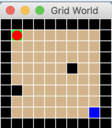

# q-learning-gridworld

A Q-learning demonstration for pathfinding in a gridworld.

## Demo



## Usage

```bash
jruby main.rb
```

## Testing

```bash
jrake test
```

## Tested Environment

- macOS Sequoia
- JRuby 10.0.2.0 (Ruby 3.4 compatible)
