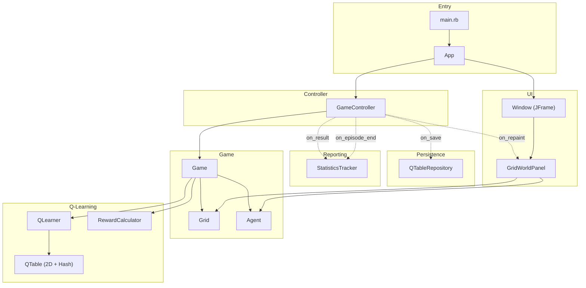
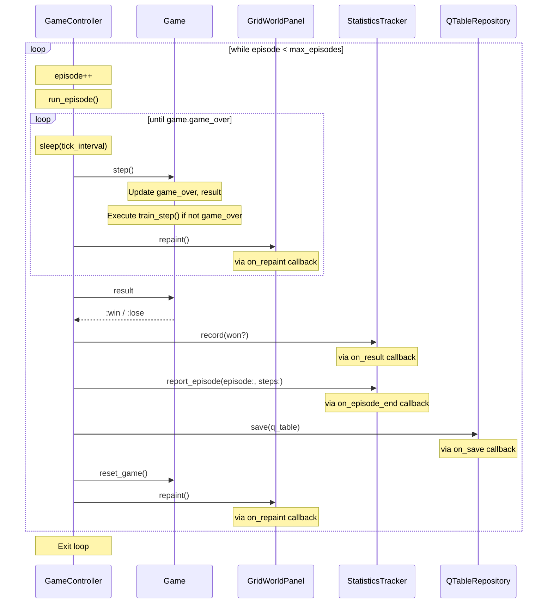
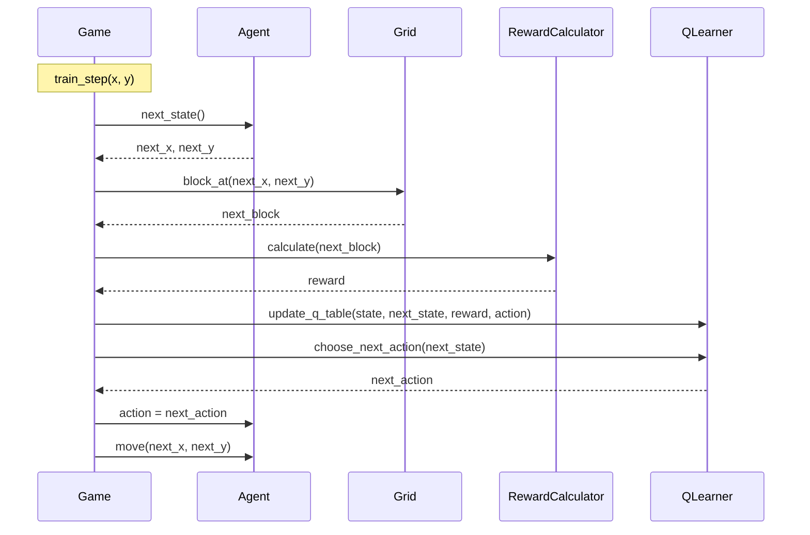

# Architecture

## Grid World Design

### Environment Layout

The grid world is a 10x10 environment with the following layout:

```
      0 1 2 3 4 5 6 7 8 9   x
    ┌─────────────────────
  0 │ H H H H H H H H H H
  1 │ H S L L L L L L L H      S = Start (agent initial position)
  2 │ H L L L L L L L L H      G = Goal (terminal, success)
  3 │ H L L L L L L L L H      L = Land (walkable ground)
  4 │ H L L L L L H L L H      H = Hole (terminal, failure)
  5 │ H L L L L L L L L H
  6 │ H H L L L L L L L H
  7 │ H L L L L L L L L H
  8 │ H L L L L L L L G H
  9 │ H H H H H H H H H H
  y
```

### Actions

| Symbol   | Direction |
|----------|-----------|
| `:left`  | x - 1     |
| `:right` | x + 1     |
| `:up`    | y - 1     |
| `:down`  | y + 1     |

### Rewards

| Block Type | Reward | Description |
|------------|--------|-------------|
| Hole (H)   | -1     | Negative reward for falling |
| Goal (G)   | +1     | Positive reward for reaching goal |
| Others     | 0      | No immediate reward |

### Q-Learning Parameters

| Parameter | Symbol | Default | Description |
|-----------|--------|---------|-------------|
| Learning Rate | α | 0.1 | How much new information overrides old Q-value |
| Discount Factor | γ | 0.9 | Importance weight of future rewards |
| Exploration Rate | ε | 0.1 | Probability of taking random action (exploration) |
| Max Episodes | - | 1000 | Total number of training episodes |

### Q-Table

The Q-table is a 2-dimensional array of hashes storing expected cumulative rewards:

```
q_table[y][x][:action]
```

- **Structure**: 10 (height) × 10 (width) grid, each cell contains a hash with 4 action keys
- **Initialization**: Random values between 0 and 1
- **Persistence**: Saved to `q_table.json` in JSON format

## Component Diagram



## Component List

| Category    | Component | Responsibility |
|-------------|-----------|----------------|
| Entry       | `main.rb` | Application startup |
|             | `App` | Build all components and inject dependencies |
| Controller  | `GameController` | Game loop control, episode/timing management, callbacks |
| Game        | `Game` | Game state, win/lose determination, and training step execution |
|             | `Grid` | Environment map definition |
|             | `Agent` | Agent position and actions |
| Q-Learning  | `QLearner` | Q-value updates and action selection |
|             | `RewardCalculator` | Reward calculation |
|             | `QTable` | 2D array of hashes storing Q-values by action symbol |
| Persistence | `QTableRepository` | Q-table save/load/create |
| Reporting   | `StatisticsTracker` | Win rate statistics and episode reporting |
| UI          | `GridWorldPanel` | Grid rendering (Swing JPanel) |
|             | `Window` | JFrame window (created by App) |

## Sequence Diagrams

### Episode Loop

Component interactions within `GameController.run()`.



### Training Step

Component interactions within `Game.train_step()`.


